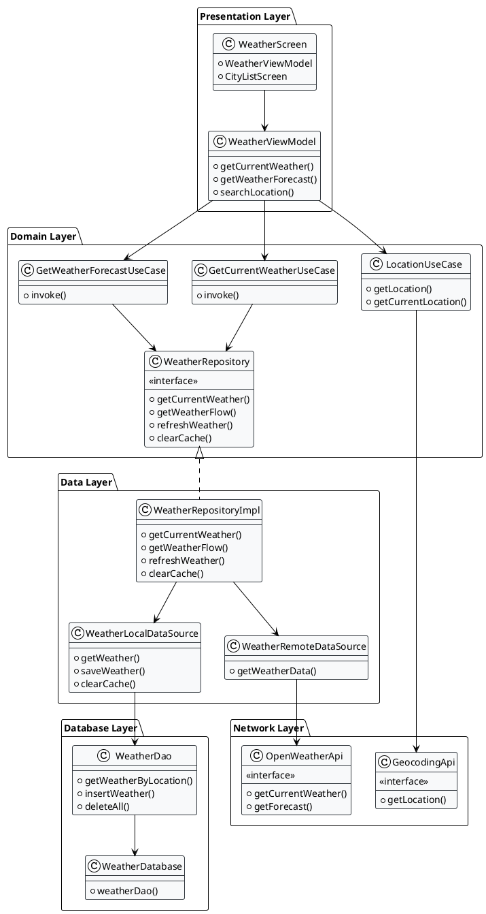

# OpenWeather Android App

一個基於 Clean Architecture 的 Android 天氣應用程式，使用 Jetpack Compose 和現代 Android 開發技術。

## 📱 功能特色

- **即時天氣資訊**: 顯示當前天氣狀況
- **5天預報**: 提供未來5天的天氣預報
- **城市搜尋**: 支援搜尋全球城市天氣
- **位置服務**: 自動獲取當前位置天氣
- **離線快取**: 支援離線查看已快取的天氣資料

## 🏗️ 架構設計

本專案採用 **Clean Architecture** 設計模式，將應用程式分為三個主要層級：

### 📦 模組結構

```
OpenWeather/
├── app/                    # 主應用模組
├── core/
│   ├── common/           # 通用工具和常數
│   ├── data/             # 資料層 (Repository, DataSource, Database)
│   ├── domain/           # 領域層 (UseCase, Model, Repository 介面)
│   └── network/          # 網路層 (API, DTO, 網路配置)
└── feature/
    └── weather/          # 天氣功能模組 (UI, ViewModel, Navigation)
```

### 🔄 依賴關係

- **app** → **feature:weather**
- **feature:weather** → **core:domain**, **core:data**
- **core:data** → **core:domain**, **core:network**
- **core:domain** → **core:common**
- **core:network** → **core:common**

## 🛠️ 技術棧

### 核心框架
- **Kotlin** - 主要開發語言
- **Jetpack Compose** - 現代 UI 框架
- **Android Architecture Components** - 架構組件

### 依賴注入
- **Hilt** - Google 官方依賴注入框架

### 網路與資料
- **Retrofit** - HTTP 客戶端
- **OkHttp** - 網路請求庫
- **Gson** - JSON 序列化/反序列化
- **Room** - 本地資料庫

### 非同步處理
- **Kotlin Coroutines** - 協程
- **Flow** - 響應式資料流

### 導航
- **Navigation Compose** - Compose 導航

### 測試
- **JUnit** - 單元測試
- **Espresso** - UI 測試

## 📋 使用套件清單

### 核心 Android
```kotlin
implementation("androidx.core:core-ktx:1.12.0")
implementation("androidx.lifecycle:lifecycle-runtime-ktx:2.7.0")
implementation("androidx.activity:activity-compose:1.8.2")
```

### Jetpack Compose
```kotlin
implementation("androidx.compose.ui:ui:1.5.8")
implementation("androidx.compose.ui:ui-tooling-preview:1.5.8")
implementation("androidx.compose.material3:material3:1.1.2")
implementation("androidx.compose.material:material-icons-extended:1.5.8")
```

### 依賴注入
```kotlin
implementation("com.google.dagger:hilt-android:2.48")
kapt("com.google.dagger:hilt-compiler:2.48")
```

### 網路請求
```kotlin
implementation("com.squareup.retrofit2:retrofit:2.9.0")
implementation("com.squareup.retrofit2:converter-gson:2.9.0")
implementation("com.squareup.okhttp3:okhttp:4.12.0")
implementation("com.squareup.okhttp3:logging-interceptor:4.12.0")
```

### 本地資料庫
```kotlin
implementation("androidx.room:room-runtime:2.6.1")
implementation("androidx.room:room-ktx:2.6.1")
kapt("androidx.room:room-compiler:2.6.1")
```

### 導航
```kotlin
implementation("androidx.navigation:navigation-compose:2.7.6")
```

### 測試
```kotlin
testImplementation("junit:junit:4.13.2")
androidTestImplementation("androidx.test.ext:junit:1.1.5")
androidTestImplementation("androidx.test.espresso:espresso-core:3.5.1")
```

## 🏛️ 架構圖

### Clean Architecture 分層



### 模組依賴關係圖

```plantuml
@startuml
!theme plain
skinparam backgroundColor #FFFFFF
skinparam packageBackgroundColor #E3F2FD
skinparam packageBorderColor #1976D2

package "app" {
    class MainActivity
    class WeatherApp
}

package "feature:weather" {
    class WeatherScreen
    class WeatherViewModel
    class CityListScreen
    class WeatherNavigation
}

package "core:domain" {
    class WeatherRepository {
        <<interface>>
    }
    class GetCurrentWeatherUseCase
    class GetWeatherForecastUseCase
    class LocationUseCase
    class Weather
    class Location
}

package "core:data" {
    class WeatherRepositoryImpl
    class WeatherRemoteDataSource
    class WeatherLocalDataSource
    class WeatherMapper
    class WeatherDatabase
    class WeatherDao
}

package "core:network" {
    class OpenWeatherApi
    class GeocodingApi
    class NetworkModule
}

package "core:common" {
    class Result
    class Constants
    class WeatherException
}

' Dependencies
app --> feature:weather
feature:weather --> core:domain
feature:weather --> core:data
core:data --> core:domain
core:data --> core:network
core:domain --> core:common
core:network --> core:common

@enduml
```

## 🚀 快速開始

### 前置需求
- Android Studio Hedgehog 2023.1.1 或更高版本
- JDK 17 或更高版本
- Android SDK API 24 或更高版本

### 安裝步驟

1. **克隆專案**
   ```bash
   git clone <repository-url>
   cd OpenWeather
   ```

2. **配置 API Key**
   - 在 [OpenWeatherMap](https://openweathermap.org/api) 註冊並獲取 API Key
   - 在 `core/common/src/main/java/com/hm/core/common/Constants.kt` 中設定你的 API Key

3. **建置專案**
   ```bash
   ./gradlew build
   ```

4. **執行應用程式**
   ```bash
   ./gradlew installDebug
   ```

## 🔧 開發指南

### 新增功能模組
1. 在 `feature/` 目錄下創建新模組
2. 在 `settings.gradle.kts` 中添加模組引用
3. 配置模組的 `build.gradle.kts`
4. 在 `app/build.gradle.kts` 中添加依賴

### 新增 UseCase
1. 在 `core/domain/src/main/java/com/hm/core/domain/usecase/` 中創建 UseCase
2. 在對應的 ViewModel 中注入並使用

### 新增 API 端點
1. 在 `core/network/src/main/java/com/hm/core/network/` 中定義 API 介面
2. 在 `NetworkModule` 中提供 Retrofit 實例
3. 在 `WeatherRemoteDataSource` 中實現 API 調用

## 🧪 測試

### 執行單元測試
```bash
./gradlew test
```

### 執行 UI 測試
```bash
./gradlew connectedAndroidTest
```

## 📄 授權

本專案採用 MIT 授權條款。

## 🤝 貢獻

歡迎提交 Issue 和 Pull Request！

## 📞 聯絡方式

如有任何問題，請透過 Issue 與我們聯繫。
